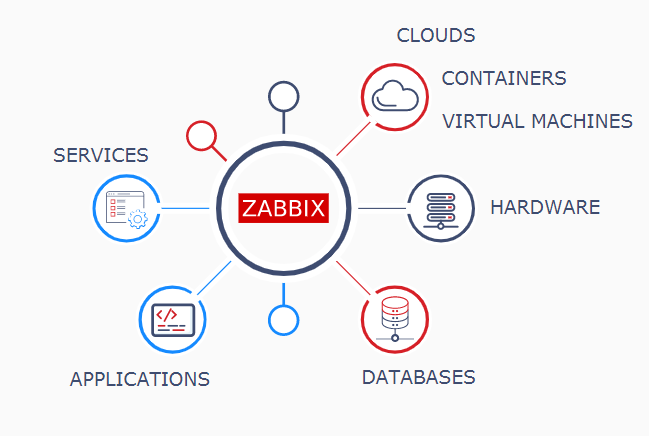

# 什么是监控系统呢
---
+ 指标，监控和警报都是相互关联的概念，它们共同构成了监控系统的基础。
+ 指标代表系统中的数据，监控是收集、汇总和分析这些值的过程，用以提高对组件特征和行为的了解。
+ 他们能够提供对系统运行状况的可见性，帮助了解系统使用或行为的趋势，并了解所做的更改的影响。如果指标超出预期范围，系统可以发送通知以提示操作员查看，然后可以提供帮助信息以确定可能的原因。
---
# 关于 Zabbix
---
+ Zabbix 是一个基于 Web 界面的企业级的分布式开源监控软件。它可以对各种网络参数以及服务器的健康性和完整性进行监控，保证系统的安全运行。
+ 
+ 下面的图中罗列了 Zabbix 可以监控的内容：Network（网络）、Server（服务器）、Cloud（云资源）、Application（应用）、Services（服务）
+ 
---
# Zabbix 的组成
---
+ Zabbix 由以下几个主要软件组件构成：
+ + Server
+ + 存储数据库
+ + Web 界面
+ + Agent 监控代理
+ 核心部分包括 Server 、Web 前端 和 存储数据库。

+ Zabbix server 是监控代理程序、报告系统可用性、系统完整性和统计信息的核心组件。

+ Zabbix 可以使用 MySQL 或者 PostgreSQL 数据库来存储数据，所有配置信息和 Zabbix 收集到的数据都被存储在数据库中。由图中的结构可知，Web GUI 和 Server 都要与数据库交互，因此两者都要配置数据库相关的信息，这在本实验后面的部分中会介绍到。

+ Zabbix 的前端使用 Web 界面。用户可以直接通过 web 界面和 Zabbix 进行交互。

+ Zabbix Agent 监控代理部署在监控目标上，能够主动监控本地资源和应用程序，并将收集到的数据报告给 Zabbix Server，完成信息的收集。
---